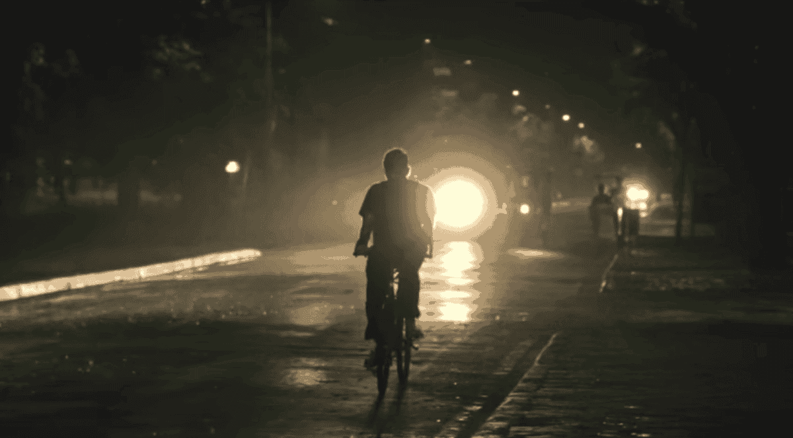
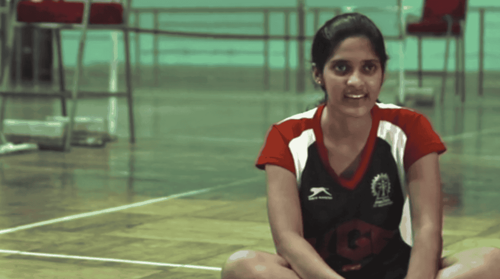
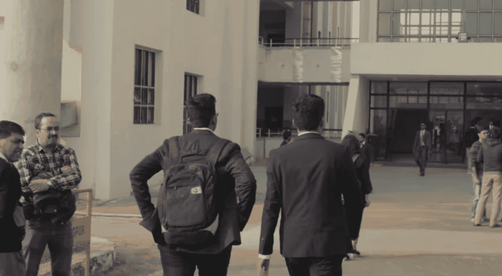
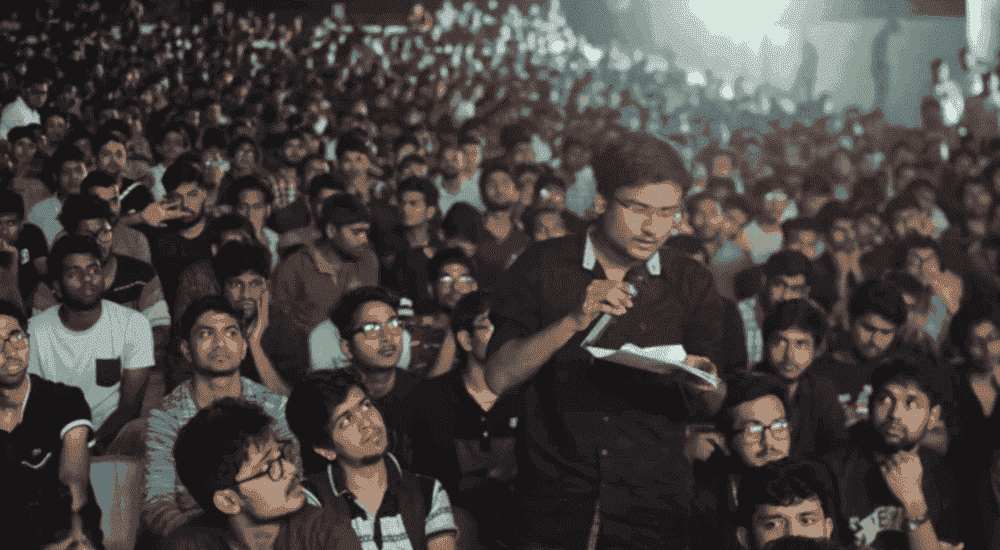

It isn't often that I find myself critiquing visual media. But [Alma Matters: Inside the IIT Dream](https://www.netflix.com/title/81368109), a documentary of life inside my very own alma mater, IIT Kharagpur, is too close to home to ignore. For a full week before the release, my social media was buzzing with posters, memes and celebrations of seeing the campus find a permanant place on Netflix. The pomp was inevitable really, having been shot in 2017-2018 when I was on campus, directed by beloved seniors and a cast full of my very own batchmates and immediate juniors.

My life running up to and at IIT Kharagpur (referred to as KGP) stretches over an absurdly long period of 10 years, from a blissfully unaware philomath who joined JEE coaching in 2008 to graduating with a Master's degree in 2018. This is more or less true for most people on that campus, which mind you is a perplexing 2000 acres but disconnected from any big city by 3 hours, keeping the students within or around its gates for entire semesters. So pretty much all of us grew up with it, were shaped by it and have a lot to say about it. This is the weight of expectations Alma Matters carried even before it aired.

Alma Matters is immediately a treat to the eyes, shot by the campus' best photographers & videographers that our young eyes always searched for at fests and festivals, hoping to get that candid picture clicked and dazzle our Facebook profiles. So it came as no surprise that the show has countless slices of life that are beautifully captured, with even the shortest of frames flooding my mind and heart with hundreds of memories. The lush greens, literal thousands of cycles in motion, lakes, halls, classrooms, sporting arenas, iconic corridors, buildings, canteens and the people filling these spaces, with their own uniqueness and character, during the expected hours of the clock and at events big and small. Every little bit just a rush of nostalgia.

The show opens to shots of [TeamKART](https://teamkart.org/) driving around their custom-built car, _bhaat_ sessions at Vegies, kids returning from weekly NCC parades, [Pravah](https://www.instagram.com/pravah_iitkgp) rehearsing in front of Vikramshila, [WTMS](http://www.gymkhana.iitkgp.ac.in/societies.html) jamming at Netaji auditorium, dramatics rehearsals for SoCult GC (Social and Cultural General Championship), a competitive quiz in progress for Tech GC, [hall day](https://wiki.metakgp.org/w/Hall_Day) debauchery, sports and the ever-so-intense [Gymkhana elections](https://web.scholarsavenue.org/tagged/elections). Tidbits that comprise a mere fraction of what people do at KGP. This did have me pondering if my friends outside KGP would catch a single one of these seemingly arbitrary events (not too arbitrary for an episode named "Independent Variables"?), but the lovely nostalgia tax that I was paid ensured this didn't bother me.

Right after which, it was down to business with the slow but obvious build up of the underlying narrative - **_The truth behind the IIT dream_**. And as it does IRL, the show starts by dipping its toes into JEE with its jovial description of life at JEE coaching _factories_ like Narayana & Chaitanya and the unfortunate sacrifice of normal life to get through one of the most competitive exams in the country. Having spent about 3 years as an adult post graduation, I definitely don't see the fuss. But I also wouldn't go all the way to say it wasn't worth it - being in IIT doesn't mean you get the best curriculum or professors or infrastructure in the country. But it does mean that you're surrounded almost entirely by extremely smart and motivated people everywhere with the wildest of passions, and that truly is what makes all the difference.

KGP, and likely all IITs in the country, also suffer from a severe imbalance in gender representation. My B.Tech batch of 1400 students had ~150 girls (10%), with a [much smaller community of non-binaries](https://wiki.metakgp.org/w/Ambar). This unquestionably brought a ton of challenges to their time at KGP that Alma Matters _could have_ set the perfect stage for them to voice. But instead, the show in its 3-episode runtime only gave [Spandana](https://www.facebook.com/awaaziitkgp/posts/1112843438736010) (General Secretary: Sports and Games, 2016-17) the opportunity to talk about the specific matter of girls at Gymkhana elections and having the rest be ironically explained by 2 usual (male) suspects, leaving me with reminders of hundreds of unvoiced rants from dear friends and the effect of daily sexism they faced outside the purview of elections - which is life for pretty much all other 140+ girls in the batch.

---

The second episode, "Escape Velocity" took me by surprise, because this is all down to placements. The all-consuming, grand finale at the end of the penultimate semester for a majority of KGP. So while I didn't expect to see it this soon, the show ensured the viewer feels the gravity of the event. Outside the disillusioned student community, the society at large has expectations of 8-digit salaries from big-name companies, forming an unrelenting pressure of getting a "good job with a good package" (even into those who dream different). And KGP, for all its glory, manages to simultaneously succeed and fail at this every year. Newspaper headlines are quick to report the job offers rolled out (with intentionally misleading currency conversions of offers from abroad), but very few, if any, talk about the actual number of students who find jobs matching their interests or core strength - and the prevelance of the increasing attention, due to lack of better opportunities, to software jobs regardless of department. And the show does a good job of nailing this down by well documenting the thoughts of the core cast as they themselves go through the process.

However, while not perceptible to the untrained eyes of an outsider, this episode ended up showing some cracks in neccessary research in writing for the show, and importantly, the extremely skewed nature of the stories being told and people being heard. From its very first minute, Alma Matters paints a picture of the student community at IIT to be rather clueless about the world they're dropped in to, merely making it through with shortcuts and no real understanding of their subject. This definitely & inevitably is the case for a subset, but isn't a true generalisation by any stretch of the imagination. Hopefully, this isn't very hard for me to convince you. Rather seemingly lost in the depths of the small cast though, the episode ends with all of the cast members having jobs, bragging their 12 or 18 lakh salaries, completely contradicting the very play of numbers that they despised all along, moreso turning a blind eye to the stories of close to a third of students [who don't even show up on placement statistics every year](https://awaaziitkgp.com/placements/). It is unfair of me to expect a short show to do-it-all, when I too was an oblivious 21 year old, same as they were when this was shot. But it is wishful thinking that 40 minutes of screen time deserves and should be capable of painting a more holistic picture.

---

_All's Well That Ends Well_ is sometimes an escape, a trick, a play at human emotions and their recency biases. The third episode "Young's Modulus" is a prime exhibit. So, how about we flip this? Let's go.

Graduation is an [emotional](https://ghostwriternr.me/blog/2018-07-05-graduation-again) [moment](https://ghostwriternr.me/blog/2017-04-13-graduation), a culmination of several years of bonding, learning and growing up together. And Alma Matters leaves you with this bundle of emotions as the cast prepares to leave the campus one last time as studens, from cosplay shenanigans, interviews with the cast on what life at KGP meant to them and sharing this beautiful little poem with the viewer.

<HindiText>हम दीवानों की क्या हस्ती है,</HindiText>
 
(What is our entity)
 

<HindiText>आज यहाँ, कल वहाँ चले आए।</HindiText>
 
(We are the nomad madmen)
 

<HindiText>मस्ती का आलम साथ चला,</HindiText>
 
(The world of frolic travels with us)
 

<HindiText>हम धूल उड़ाते यहाँ चले आए।</HindiText>
 
(Us the nomad madmen)
 

<HindiText>आए बनकर उल्लास अभी,</HindiText>
 
(We arrived as exuberance)
 

<HindiText>आंसू बनकर बह चले अभी।</HindiText>
 
(We flowed away as tears)
 

<HindiText>तुम कहते ही रह गए, अरे,</HindiText>
 
(The world wonders where we came from)
 

<HindiText>तुम कैसे आए, कहाँ चले आए।</HindiText>
 
(Us the nomad madmen)
 

<HindiText>किस ओर चले, यह मत पूछो,</HindiText>
 
(You don't want to know where we choose to go)
 

<HindiText>बस चलना था, इसलिए चले।</HindiText>
 
(We go, for our destiny seemed so)
 

<HindiText>जग से उसका कुछ लिये चले,</HindiText>
 
(We give and take from the world, as we flow)
 

<HindiText>जग को अपना कुछ दिये चले।</HindiText>
 
(Us the nomad madmen)
 

On a day I had more strength, I'd probably also obsess over re-living one of KGP's most beloved cultures. "Illu" (short for Illumination) is how we celebrate the festival of Diwali. But seeing it be filled with rants about students not showing up for contributing towards the festival by people with the time and energy to do so, was beyond absurd. I remember my very own first couple years on campus, struggling to compete and catch-up with the intense academics, failing miserably at it and having Illu be the least of my priorities. I was mentally overwhelmed and exhausted. And here's where my hatred for the job of a critic begins, because well, this feels too easy. Watching the third episode unfold, broadly divided into 2 disconnected and contrasting sections with the celebration of Illu and of suicides on campus, was definitely infuriating. So before I get to the latter, please use this as a trigger warning for the content below.

The year [2017 saw 5 suicides happen on campus](https://wiki.metakgp.org/w/2017_Suicides_Ordeal), the most in any single year, and were primarily students in their 3rd and 4th years. My batchmates. Getting through that year was excruciating, as young adults trying to understand the nature of the action & associated loss, being agitated by the campus' measures to keep the word from spreading too far and their prolonged inaction towards understanding the root cause for prevalent depression on campus. Seeing this picked up by Alma Matters was immediately sensitive to me, and it started with the right notes by documenting the crucial (but mostly pointless) Open House we had with The Director at the time. But the show peaks at its lack of authenticity at a colossal scale here. Mental health is not a simple science with catchall answers or explanations, let alone one that every 21 year old understands. Yet, rather than having a thorough study, having subject matter experts explain what went wrong, listen to personal experiences of students who were clinically depressed or their experiences with the campus Counselling Center, we instead see the young cast fumble towards the possible reasons why their friend died of suicide. Several poor, trivial, almost deriding guesses, for 15 grim minutes. Trivializing mental health, especially with access to Netflix's wide audience, didn't help bear the never-ending misconceptions we have towards mental health. But this is what the show chose to do, and I wish it hadn't.

---

At the end of it all, Alma Matters left me with absolutely nothing new that I didn't know before. At best, it was a reminder of the worst parts of KGP - which the show did set out to showcase. But at worst, its creators also stayed too close to home and ended up with not being able to sufficiently piece together why home was in disarray, and left their work feeling extremely skewed, begging for depth and being very disconnected from what an outsider can take away. Just like the show, I too, probably am too close to home to be able to not appreciate the hard-work of some of my favourite people. But for now, maybe its just another imperfection we display as humans. And maybe, we will do better next time.
