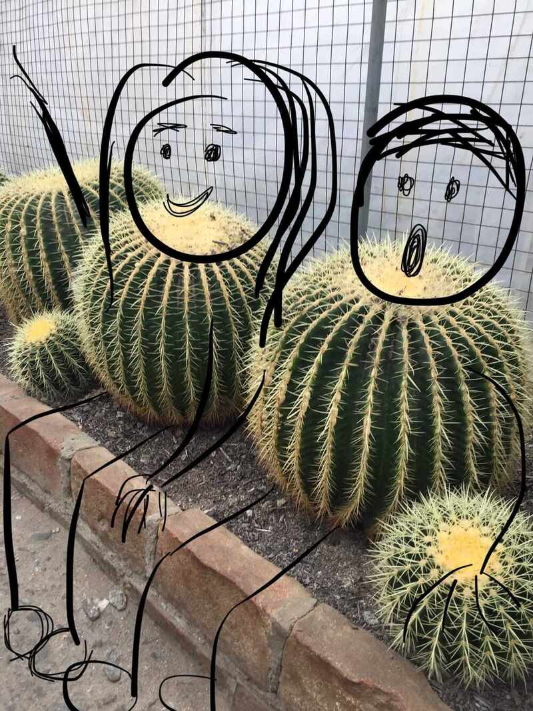

You make me feel pretty.

Today, as I was walking through the waiting room at the cinema, I caught a glimpse of myself in the mirror. Nothing that I haven't seen before. Nothing apart from the droopiness in my eyes that usually reminds me of the flowers in my garden withering and falling. Or my arms of the thin branches growing on maple trees that the big boys break and play gilli danda on the streets. Or my skin of that kid in class who no one remembers, who isn't invited to birthday parties and is always picked last in team games just because the sides need to be even.

But I saw myself in the mirror and remembered none of that. Today, I felt pretty.

You called me casually in the morning, relaxing on a couch 3000 kilometres away with a cup of tea, just to say, "You're beautiful". I remembered being quite taken aback by how quickly my mind lit up. The flowers in my garden bloomed into the colours of autumn and filled an orchard, the maple trees were glowing majestically in the sunlight and I was the kid in the classroom remembered for having the brightest smile. I remembered feeling confounded of the way 'beautiful' sounded when you said it. To me. I remembered being elated and shocked by the very idea of someone, for the first time, telling me, a boy, that I'm beautiful.

Boys are always asked to be brave, to be strong, to be smart and to be successful. Boys in my family are expected to compete and win and be "a man". But boys in my family are never called pretty. My sisters aren't allowed to play in the sun because they might get dark and can't eat too much because they might grow fat, all the while as I'm looking into the mirror at a boy who is all this. A boy with a glimmering heart and a forgotten body.
It was that boy who'd always enjoyed telling you stories of his favourite adventures and asked questions about space, but never touched you because he wasn't worthy. It was that boy who was always jealous of the other boys in college with whom you went for a coffee, but never said anything because he wasn't worthy. It was that boy who always preferred to be hidden, because he wasn't worthy.

But today, I could see him in the mirror. He was smiling back at me. The same one in all those photographs that you keep sending me of the both of us. And I didn't tell him anything, just the way I couldn't tell you anything on that phone call.

In both occasions, I only wished I could have atleast said... "Thank you". For reminding me.
